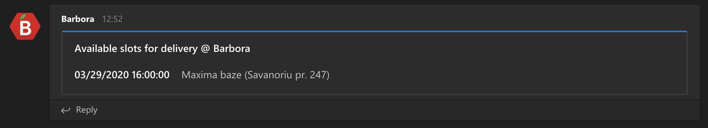

# Barbora.lt free slots

This script queries www.barbora.lt website for any free slots available for delivery or at pick-up points and sends
notifications to Microsoft Teams WebHook if configured (optional).

## Running script

To start the query, initialise Barbora class and provide your own credentials:

```python
from Barbora import Barbora
barbora = Barbora(username="user@example.com", password="Pa$$w0rd", msteams_webhook=None)
barbora.run_once()
```

There are two methods for querying available slots:

- `barbora.run_once()` - runs one time query
- `barbora.run_loop(delay_in_seconds=300)` - queries portal at every 5 minutes

## Notifictaions

If MS Teams WebHook is provided to `Barbora()` class, script will automtaically send notifications once free slot is available at any location.




## Locations to query

This script queries Barbora.lt for all configured locations in provided user account. This means all default locations (pick-up points) and user's custom loctionas added to address book are in scope.